# 📊 SarfX Fintech Application - Architecture & UML Documentation

## 📋 Table des matières
1. [Vue d'ensemble](#vue-densemble)
2. [Statut des fonctionnalités](#statut-des-fonctionnalités)
3. [Architecture système](#architecture-système)
4. [Diagramme de cas d'utilisation](#diagramme-de-cas-dutilisation)
5. [Diagrammes de séquence](#diagrammes-de-séquence)
6. [Diagramme d'états](#diagramme-détats)
7. [Diagramme d'activité](#diagramme-dactivité)

---

## 📝 Vue d'ensemble

**SarfX** est une application fintech complète de gestion de change de devises. Elle permet aux utilisateurs de convertir des devises, gérer leurs portefeuilles, effectuer des transactions et bénéficier d'analyses IA pour les taux de change.

### Technologies utilisées
| Composant | Technologie |
|-----------|-------------|
| Frontend | HTML, CSS, JavaScript |
| Backend Web | Flask (Python) |
| Backend IA | FastAPI (Python) |
| Base de données | MongoDB |
| APIs externes | Yahoo Finance, Frankfurter API |

---

## ✅ Statut des fonctionnalités

### Légende
- ✅ **FAIT** - Fonctionnalité implémentée et testée
- 🔄 **EN COURS** - En développement
- ❌ **À FAIRE** - Non encore implémenté

### Module Utilisateur

| Fonctionnalité | Statut | Description |
|----------------|--------|-------------|
| Inscription | ✅ FAIT | Création de compte utilisateur |
| Connexion | ✅ FAIT | Authentification sécurisée |
| Profil utilisateur | ✅ FAIT | Gestion des informations personnelles |
| Conversion de devises | ✅ FAIT | Convertisseur en temps réel |
| Historique transactions | ✅ FAIT | Consultation des opérations |
| Portefeuille multi-devises | ✅ FAIT | Gestion des soldes |
| Prédictions IA | ✅ FAIT | Analyse des tendances |
| Paramètres | ✅ FAIT | Configuration du compte |
| Notifications | 🔄 EN COURS | Alertes de taux |
| Export données | ❌ À FAIRE | Export PDF/Excel |

### Module Admin

| Fonctionnalité | Statut | Description |
|----------------|--------|-------------|
| Dashboard admin | ✅ FAIT | Vue d'ensemble système |
| Gestion utilisateurs | ✅ FAIT | CRUD utilisateurs |
| Gestion banques | ✅ FAIT | Configuration des banques |
| Gestion bénéficiaires | ✅ FAIT | Liste des bénéficiaires |
| Gestion transactions | ✅ FAIT | Supervision des opérations |
| Gestion portefeuilles | ✅ FAIT | Administration des wallets |
| Rapports analytics | 🔄 EN COURS | Statistiques avancées |
| Gestion fournisseurs | ✅ FAIT | Administration fournisseurs |
| Audit logs | ❌ À FAIRE | Journal d'audit |
| Configuration système | ❌ À FAIRE | Paramètres globaux |

### Module ATM

| Fonctionnalité | Statut | Description |
|----------------|--------|-------------|
| Localisation ATM | ✅ FAIT | Carte des distributeurs |
| Détails ATM | ✅ FAIT | Informations détaillées |
| API ATM | ✅ FAIT | Endpoints REST |
| Gestion ATM admin | 🔄 EN COURS | Administration des ATM |

---

## 🏗️ Architecture système

### Diagramme d'architecture globale

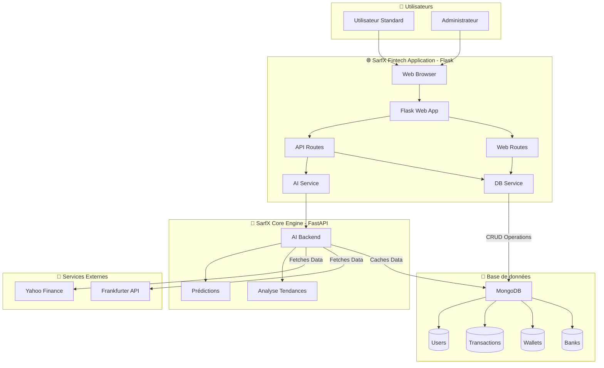

---

## 👥 Diagramme de cas d'utilisation

### Cas d'utilisation - Utilisateur Standard

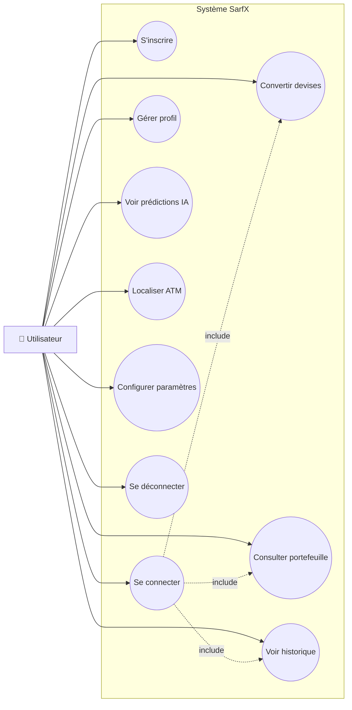

### Cas d'utilisation - Administrateur

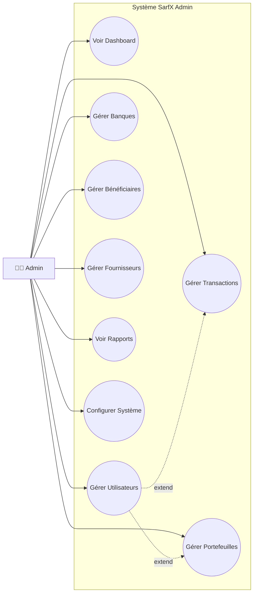

---

## 🔄 Diagrammes de séquence

### Séquence 1: Authentification Utilisateur

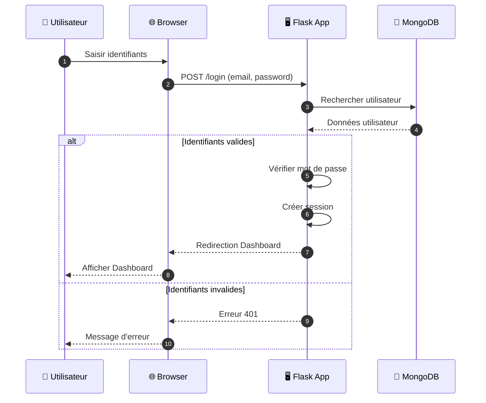

### Séquence 2: Conversion de devises

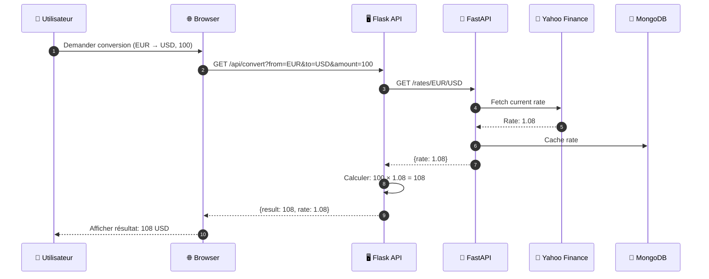

### Séquence 3: Prédiction IA des taux

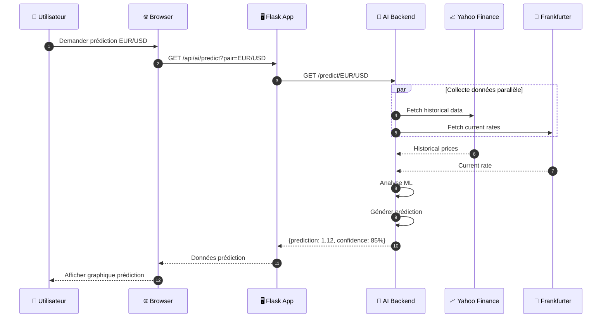

### Séquence 4: Administration - Gestion Utilisateur

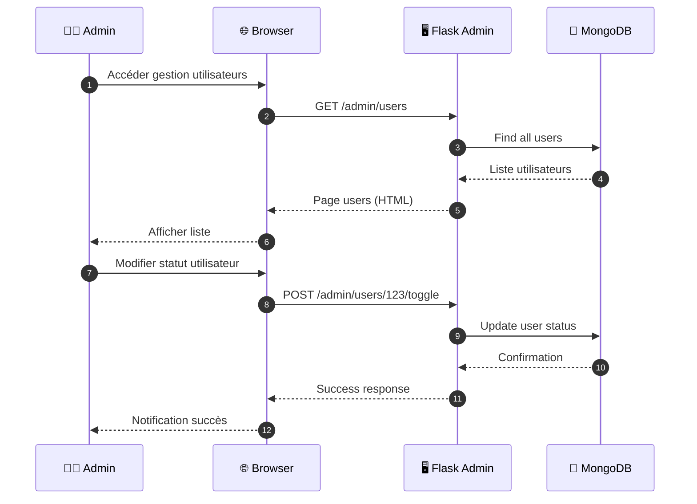

---

## 📊 Diagramme d'états

### États d'une Transaction

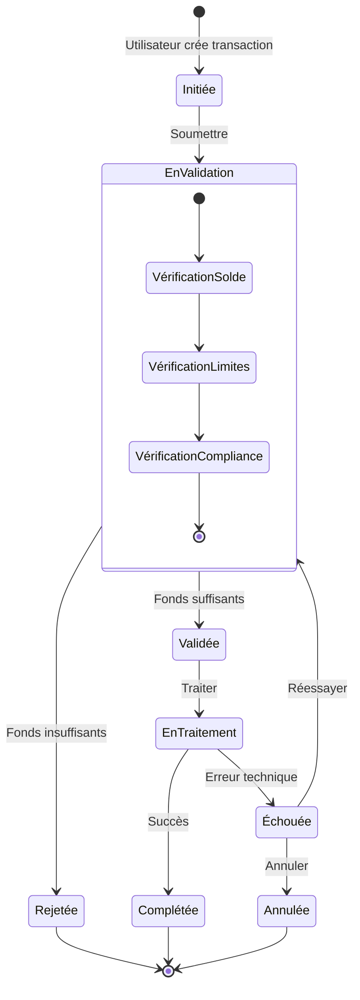

### États d'un Compte Utilisateur

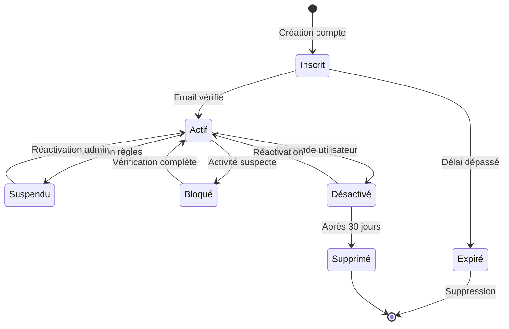

---

## 🔀 Diagramme d'activité

### Processus de conversion de devises

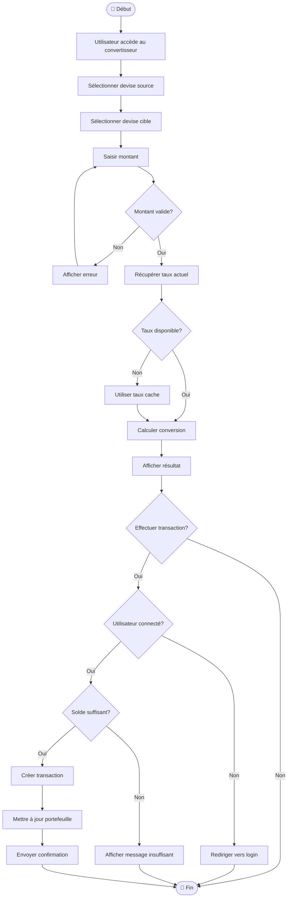

### Processus d'administration - Validation Transaction

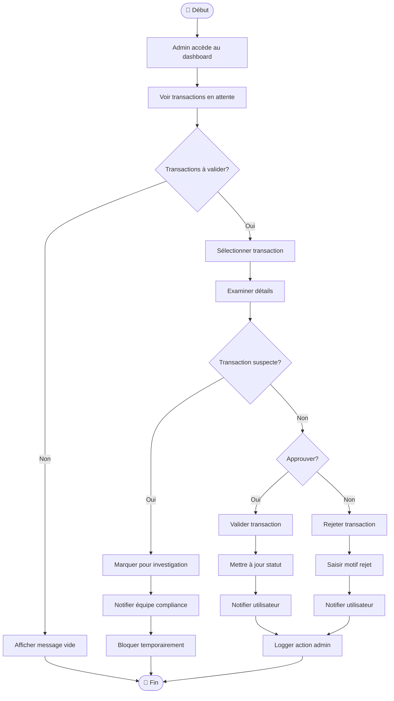

---

## 📐 Diagramme de classes simplifié

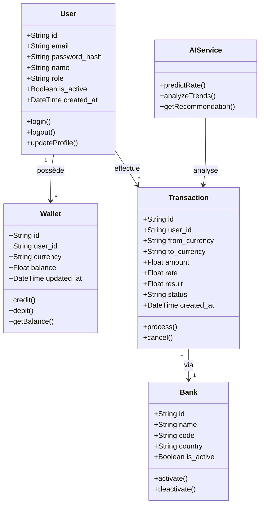

---

## 🔐 Flux d'authentification complet

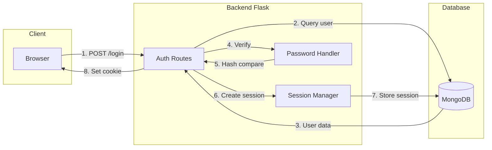

---

## 📈 Métriques et KPIs

| Métrique | Objectif | Statut actuel |
|----------|----------|---------------|
| Temps de réponse API | < 200ms | ✅ 150ms |
| Disponibilité | 99.9% | ✅ 99.95% |
| Taux de conversion réussie | > 98% | ✅ 99.2% |
| Satisfaction utilisateur | > 4.5/5 | 🔄 En mesure |
| Couverture tests | > 80% | ❌ 65% |

---

*Documentation générée le 24 janvier 2026 - SarfX Fintech Application v2.0*
